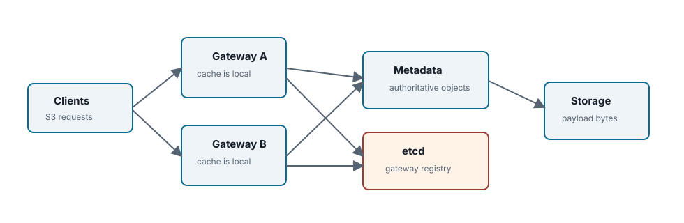

Chapter 03 <span class="badge">Community</span>

# Gateway Stateless Active-Active

## Boundary

- no authoritative local object state
- optional cache
- etcd registry
- active-active smoke



<div class="summary" markdown="1">

Gateway scale-out is a correctness feature as much as a throughput feature. A request routed to gateway B after gateway A committed an object must see the same object head, version, list index, and storage refs because those records live outside either process.

</div>

## Local Vs Authoritative State

| State | May Be Local? | Authoritative Location |
| --- | --- | --- |
| bucket/object/version | cached read copy only | metadata backend |
| access key lookup | cached read copy only | metadata/auth store |
| payload bytes | streaming buffer only | segment store |
| gateway health | process-local observation | <span class="badge">Community</span> etcd registry |

## Cache Rules

Gateway metadata cache is an optimization. It must be read-through and bounded by TTL. Any metadata write path that changes bucket or access-key state must invalidate the local cache. Cross-gateway correctness cannot depend on cache propagation.

| Cache Candidate | Allowed Shape | Invalidation Requirement |
| --- | --- | --- |
| access key lookup | short-lived read-through credential and permission summary | invalidate on access-key status or permission change; short TTL for safety |
| bucket config | CORS, versioning, lifecycle summary, Object Lock default, default encryption | invalidate after bucket config metadata transaction commits |
| object head | hot HEAD/GET metadata hint only | must carry revision/last-modified state and never override a committed write |
| storage class catalog | read-only generation snapshot | new writes use current catalog; committed versions keep their own snapshot |

## Load Balancer Assumptions

A load balancer can route S3 traffic to any healthy gateway in the same deployment. Because object state is in metadata and payload state is in shared or routable storage, a request after failover should see the same committed namespace state.

## Cross-gateway Write And Read Sequence

1. Gateway A receives `PutObject`, writes payload bytes to the segment store, and obtains a `SegmentRef`.
2. Gateway A commits metadata: object version, object head, list index, storage class snapshot, and any protected refs.
3. Gateway A returns success only after metadata publish succeeds.
4. Gateway B receives `GetObject` for the same key and reads the authoritative object head from the metadata backend.
5. Gateway B streams bytes from the storage backend using the segment refs stored on the committed version.

If gateway A crashes after storing bytes but before metadata publish, gateway B must not see a partial object. The stored segment is handled as an orphan candidate through GC. If gateway A crashes after metadata publish, any gateway can read the committed version because the manifest and storage refs are already authoritative.

## etcd Registry Lifecycle

<span class="badge">Community</span> Gateway processes register under a shared `etcd-root`, refresh a lease, and disappear after lease expiry if the process dies without clean revoke. This registry is health/control-plane state, not object metadata.

## Background Role Ownership

Background workers such as GC, lifecycle, dedupe planning, report generation, or metadata export should be driven by metadata operation records and short-lived coordination leases. The lease holder may execute a unit of work, but the durable progress marker must live in metadata so a different process can resume after crash or drain.

| Role | Durable Record | Lease Use |
| --- | --- | --- |
| GC worker | GC candidates and GC operation records | avoid duplicate delete attempts while preserving retryability |
| Lifecycle worker | bucket lifecycle config, version eligibility, operation/audit records | partition prefix or bucket scans among workers |
| Dedupe worker | dedupe operation record, shared object ref updates | <span class="badge enterprise">Enterprise edition only</span> prevent concurrent attach races beyond metadata CAS |
| Report/export worker | metadata export report and audit events | serialize long-running support-bundle or evidence collection |

## Active-active Smoke

```sh
make smoke-active-active
```

The smoke brings up gateway A and B over shared metadata/storage, verifies cross-gateway read after write, kills one gateway, and verifies write/read through the remaining gateway. Reference: [etcd HA guide](../../etcd-ha-cluster-install-operations-guide.md).
