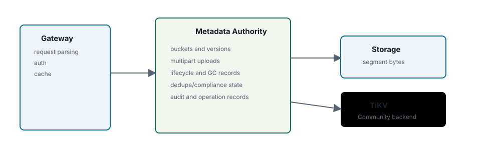
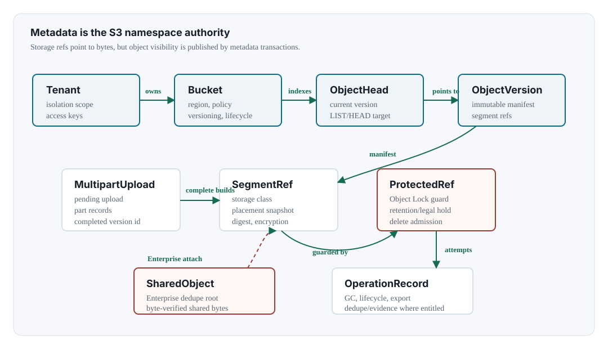

Chapter 04 <span class="badge">Community</span> <span class="badge enterprise">Enterprise edition only sections</span>

# Metadata Authority

## Metadata

- entities
- buckets
- list indexes
- transactions
- backends
- backup

<div class="note" markdown="1">

**Edition scope.** This chapter describes Community edition metadata authority and Enterprise edition only evidence/compliance posture state. Enterprise-only metadata rows are private-distribution contracts or Community denial boundaries, not public Community feature enablement.

</div>



## Authoritative Entities

| Entity | Purpose | Why It Must Be Metadata-owned | Representative Fields |
| --- | --- | --- | --- |
| `Tenant` | account or administrative isolation boundary | bucket visibility and dedupe/admission scope depend on tenant identity | `tenant_id`, display name, creation time |
| `AccessKey` | S3 credential and permission summary | all gateways must make the same auth decision after credential changes | tenant id, access key id, secret hash, status, permissions |
| `Bucket` | namespace root and bucket-level policy/config | clients must observe consistent bucket existence, region, versioning, CORS, lifecycle, encryption, Object Lock, and policy state | bucket id, name, tenant id, versioning state, lifecycle, default encryption, Object Lock config, policy |
| `ObjectHead` | current S3-visible object pointer | GET/HEAD/LIST must resolve the same current version after a committed mutation | bucket id, key, version id, size, ETag, content type, storage class, segment refs, lock state |
| `ObjectVersion` | immutable committed version or delete marker | versioning, object lock, lifecycle, dedupe, and GC all reason about version reachability | version id, sort key, state, delete marker, storage class, encryption, segment refs, tags, lock state |
| `MultipartUpload`/`MultipartPart` | pending upload state and staged part segments | parts are not normal object versions until complete publishes a manifest | upload id, part number, ETag, size, part segment ref, completed version id |
| `ProtectedRef` | delete guard for object lock and protected roots | payload deletion must fail closed when retention/legal hold protection is active or unreadable | reason, bucket/key/version, segment ref, retention mode/date, legal hold |
| `SharedObject`/`SharedObjectRef` | <span class="badge enterprise">Enterprise edition only</span> dedupe shared payload authority | shared bytes need refcount repair, protected-root accounting, and safe reclaim independent of hash indexes | shared object id, digest, storage class, segment refs, ref count, protected root count |
| operation records | GC, dedupe, compliance, release, import/export evidence | operations need retry/resume/audit state across gateway restarts and worker failover | operation id, status, attempts, counts, timestamps, errors |
| KMS/compliance posture | <span class="badge enterprise">Enterprise edition only</span> evidence and policy state | security posture must survive gateway restarts and be exportable as evidence | KMS key state, compliance profile attachment, audit chain refs |

## Metadata Schema Map



The schema is intentionally object-native. A bucket/key maps to an object head. The object head points to a version. The version contains a manifest of storage refs. The storage refs point to payload locations, but they do not define object namespace visibility by themselves.

## Bucket Metadata Ownership

NAMROS metadata, not SBS, owns bucket identity and bucket-level configuration. A gateway handles the S3 request and may cache read results briefly, but the authoritative record lives in the selected metadata repository. In production, that repository is TiKV so every gateway resolves the same bucket id, versioning state, policy, lifecycle rules, default encryption posture, Object Lock posture, quota configuration, and list indexes after a committed transaction.

| Metadata Record | Owned By | Used For | Storage Relationship |
| --- | --- | --- | --- |
| `Bucket` | metadata repository | bucket name to bucket id mapping plus bucket policy/config | does not contain a fixed SBS volume assignment |
| `ObjectHead` | metadata repository | current key lookup for GET/HEAD/LIST and overwrite/delete behavior | points to the current object version, not directly to SBS |
| `ObjectVersion` | metadata repository | immutable committed payload manifest, delete marker, tags, user metadata, retention state | contains segment refs with placement snapshots |
| `ListIndex` | metadata repository | ordered key and prefix enumeration for LIST APIs | derived from committed object visibility, independent of physical volume location |
| `VolumePool` | metadata repository plus SBS observability | logical set of writable/readable SBS members for new payload placement | selected at write time; old versions keep their recorded placement |

## Object List Index

The bucket list is metadata state. NAMROS maintains an ordered list index under the bucket id so `ListObjectsV2`, delimiter grouping, continuation tokens, and version listing can scan by key range instead of reading payload storage. The list index is updated in the same publish transaction that creates a new current object head or delete marker. A LIST response should therefore describe the committed namespace, even when payload bytes for different keys live on different SBS volumes or EC shard groups.

```text
/namros/buckets/by-name/photos -> b-001
/namros/buckets/b-001/objects/2026/08/cat.jpg/head -> v-0007
/namros/buckets/b-001/versions/2026/08/cat.jpg/ts-v-0007 -> ObjectVersion
/namros/buckets/b-001/list/2026/08/cat.jpg -> ListIndexEntry

ListObjectsV2(bucket=photos, prefix=2026/08/, continuation=C)
  -> scan /namros/buckets/b-001/list/2026/08/... from continuation
  -> return keys according to metadata visibility
  -> never scan SBS volumes to discover object names
```

Repair tooling may rebuild list entries from committed object heads and versions, but SBS chunk or shard inventory is not allowed to become the S3 namespace index.

## Keyspace Shape

The production backend needs ordered keys and multi-key transactions. Exact encoding can evolve, but the architecture depends on the following logical indexes.

```text
/namros/tenants/{tenant_id}
/namros/access-keys/{access_key_id}
/namros/buckets/by-name/{bucket_name} -> bucket_id
/namros/buckets/{bucket_id}/config
/namros/buckets/{bucket_id}/objects/{escaped_key}/head
/namros/buckets/{bucket_id}/versions/{escaped_key}/{version_sort_key}
/namros/buckets/{bucket_id}/list/{escaped_key}
/namros/buckets/{bucket_id}/multipart/{upload_id}
/namros/buckets/{bucket_id}/protected-refs/{ref_id}
/namros/operations/gc/{operation_id}
```

Large deployments may shard hot prefixes or move large manifests into secondary records, but the object head and list index must remain transactionally consistent with the committed version that clients see.

## Backends

| Backend | Role | Use |
| --- | --- | --- |
| memory | in-process repository | unit tests and simple fixtures |
| Pebble | local persistent repository | Community local development |
| TiKV | <span class="badge">Community</span> distributed repository | active-active gateway deployments |

## Transaction Boundaries

Critical operations must update related metadata atomically: bucket creation, object version publish, multipart complete, lifecycle version delete, protected ref materialization, shared object attach, and operation record creation. Large multipart completes should avoid unbounded transaction growth by summarizing parts or chunking manifest state where necessary.

| Operation | Must Be Atomic | Failure Rule |
| --- | --- | --- |
| `PutObject` publish | object version, object head, list entry, idempotency result, old-segment GC candidates, protected refs when Object Lock applies | if metadata commit fails, the written segment is not visible and must be marked for orphan cleanup |
| `CompleteMultipartUpload` | MPU completed state, final object version, object head, list entry, part summary, protected refs | if part validation or storage validation fails, no object head is published |
| `DeleteObject` | delete marker or explicit version removal, head/list update, protected-ref evaluation, GC candidates, audit event | if retention/legal hold/protected refs are active or unreadable, fail closed |
| shared object attach | <span class="badge enterprise">Enterprise edition only</span> shared object record, object version segment refs, shared object ref, previous segment release candidates | never attach from hash alone; byte verification must already have passed |
| KMS/key posture update | <span class="badge enterprise">Enterprise edition only</span> key state, affected encryption admission posture, audit event | decrypt/delete admission must fail closed when key state cannot be established |

## Consistency Requirements

- Committed object reads must see the latest published version according to bucket/versioning rules.
- Failed physical writes must not publish object heads.
- Delete paths must check protected refs and fail closed when protection state cannot be read.
- Gateway-local cache must never become the source of truth.

## Backup And Restore

Product-level metadata backup/export records NAMROS collections and audit hashes. It is distinct from a low-level backend snapshot. Both can be useful, but the product-level export is the controlled path for migration/preflight/restore workflows. Reference: [admin guide](../../admin-guide.md).
