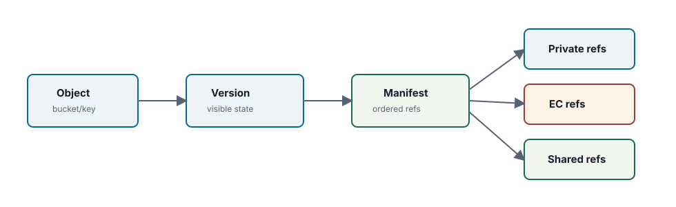
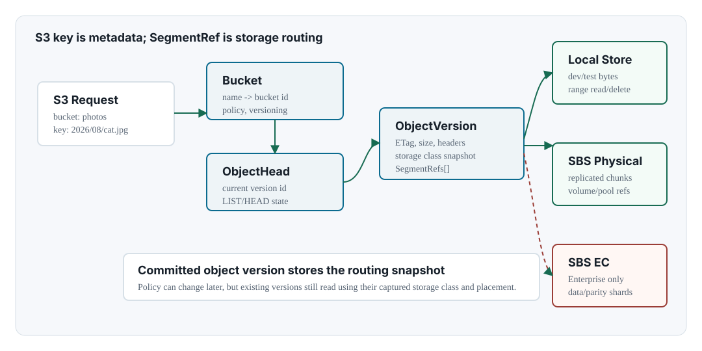

Chapter 05 <span class="badge">Community</span> <span class="badge enterprise">Enterprise edition only sections</span>

# Object And Segment Model

## Model

- object versions
- manifests
- segments
- protected refs

<div class="note" markdown="1">

**Edition scope.** This chapter defines the Community edition object/segment model and references Enterprise edition only shared-object and EC segment forms. Treat dedupe-shared and EC classroute references as private-distribution behavior unless the text is describing Community denial or protected cleanup semantics.

</div>



## Visibility Model

A committed object version is S3-visible. It points to a manifest, and the manifest points to segment references. The storage backend owns the bytes behind those references, but metadata owns whether a version is current, noncurrent, deleted, locked, or shared.



| Concept | Stored In | Meaning |
| --- | --- | --- |
| bucket | metadata | namespace and bucket-level config |
| object version | metadata | S3-visible version state and headers |
| manifest | metadata | ordered segment references and digest/size data |
| private segment ref | metadata + storage | payload segment owned by one object version |
| shared segment ref | metadata + storage | <span class="badge enterprise">Enterprise edition only</span> payload segment shared by dedupe |
| protected ref | metadata | delete guard for WORM/Object Lock/protected roots |

## Object-to-storage Mapping

An S3 bucket/key is never used as the physical SBS address. NAMROS first maps bucket/key to an object version in metadata. The object version carries a manifest. The manifest contains one or more `SegmentRef` values. Each segment ref contains the storage class snapshot and placement snapshot needed to find bytes in the active backend.

```text
S3 request
  bucket = photos
  key    = 2026/08/cat.jpg

metadata authority
  Bucket{Name: photos, BucketID: b-001}
  ObjectHead{BucketID: b-001, Key: 2026/08/cat.jpg, VersionID: v-0007}
  ObjectVersion{VersionID: v-0007, SegmentRefs: [seg-a, seg-b]}

storage authority
  SegmentRef{SegmentID: seg-a, StorageClass: STANDARD, Placement: sbs-physical chunks}
  SegmentRef{SegmentID: seg-b, StorageClass: STANDARD, Placement: sbs-physical chunks}
```

That separation lets NAMROS preserve S3 namespace behavior while changing storage placement over time. Existing versions continue to read through the storage class and placement snapshot captured when they were committed.

## Logical And Physical Storage Layers

NAMROS uses two storage layers for SBS-backed objects. The logical layer is visible to NAMROS metadata: bucket, key, object version, storage class, volume-pool id, and segment refs. The physical layer is owned by the storage backend: replicated chunks inside an SBS volume for Community replicated storage, or <span class="badge enterprise">Enterprise edition only</span> EC stripes and data/parity shards for EC storage classes.

| Layer | Record | Replicated Mapping | EC Mapping |
| --- | --- | --- | --- |
| S3 namespace | bucket/key/version | unchanged by volume selection | unchanged by EC profile selection |
| NAMROS placement | `SegmentRef` and storage class snapshot | records SBS volume id plus chunk/span placement | records storage class, stripe profile, shard ids, and store placement |
| Volume pool | pool id and active member generation | chooses a writable replicated SBS volume for new segments | chooses the EC-capable route or member set used by the Enterprise backend |
| Physical storage | SBS chunks or EC shards | replicated physical chunks according to SBS durability | data/parity shards with quorum and healing rules |

A bucket is not assigned to one SBS volume. One bucket can contain object versions placed on many pool members, and one SBS volume can contain segments for many buckets. The committed object version remains readable because every segment ref records the concrete placement that was chosen when that version was published.

## Core Record Shapes

| Record | Key Fields | Architectural Meaning |
| --- | --- | --- |
| `ObjectHead` | bucket id, key, version id, size, ETag, content type, storage class, encryption, object lock state, segment refs | Fast current-version lookup for GET/HEAD/LIST. It is updated when a new version becomes current or a delete marker is created. |
| `ObjectVersion` | version id, sort key, committed state, delete marker flag, tags, user metadata, storage class snapshot, encryption, segment refs, lock state | Immutable version record used for versioned reads, lifecycle, GC, Object Lock, dedupe, evidence, and recovery. |
| `SegmentRef` | segment id, storage class snapshot, placement snapshot, size, digest, encryption envelope, shared object id | The bridge from NAMROS object metadata to a concrete storage backend address. |
| `PlacementSnapshot` | backend, layout, redundancy backend, profile id/generation, chunk size, placement chunks | Captures enough physical routing information to read, repair, delete, or audit a committed object even after placement policy changes. |
| `ProtectedRef` | reason, bucket/key/version, segment id/ref, retention mode/date, legal hold | Blocks physical reclaim when Object Lock, rollback, or protected-root semantics still require payload reachability. |

## SegmentRef And Placement Snapshot

The `SegmentRef` is the unit the gateway and workers pass to storage. It must be self-describing enough for future reads and deletes. A ref that only says "object key X" would be incorrect because object keys can be overwritten, versioned, deleted, locked, deduped, or moved to another storage class.

```text
SegmentRef
  SegmentID
  StorageClassSnapshot
    StorageClassID
    Backend
    Parameters
  PlacementSnapshot
    Backend
    Layout
    RedundancyBackend
    ProfileID
    ProfileGeneration
    Chunks[]
  SizeBytes
  Digest
  EncryptionEnvelope
  SharedObjectID
```

For a replicated SBS physical segment, the placement snapshot can describe physical chunks in one or more volume pools. For an EC segment, the placement snapshot describes stripes and shard roles. For a deduped object, the visible object version may point to a shared object ref rather than its original private segment refs.

## Segment Reference Types

| Reference Type | Where It Comes From | Read Behavior | Delete/GC Behavior |
| --- | --- | --- | --- |
| Private segment ref | normal `PutObject` or `UploadPart` write | read exact bytes from the referenced backend span | eligible for GC only when no object version, part, or protected ref reaches it |
| Shared object ref | <span class="badge enterprise">Enterprise edition only</span> byte-verified dedupe attach | read through shared object layout while preserving original object bytes and metadata | refcount summaries are advisory; manifest reachability and protected refs are authority |
| EC segment ref | <span class="badge enterprise">Enterprise edition only</span> storage class route to SBS EC backend | read enough data/parity shards to reconstruct the requested range | delete admission must handle every shard and fail closed on protection errors |

Private segment references are the normal upload output. Shared references appear after <span class="badge enterprise">Enterprise edition only</span> dedupe verifies bytes and attaches an object version to a shared object. EC segment references point through <span class="badge enterprise">Enterprise edition only</span> classroute/SBS storage paths.

## Read Path

1. Resolve bucket and key in metadata.
2. Select current head or explicit version according to S3 versioning rules.
3. Reject reads that violate authorization or policy; Object Lock usually affects delete, not normal read.
4. Translate requested byte range into manifest spans.
5. For each span, call `SegmentStore.GetSegment` with the segment ref, offset, and length.
6. Stream bytes to the S3 client while preserving ETag, checksum, object metadata, encryption response headers, and range response semantics.

## Write Path

1. Resolve bucket policy, storage class, Object Lock defaults, and encryption policy.
2. Stream request bytes to the selected segment backend.
3. Capture digest, size, storage class snapshot, placement snapshot, and encryption envelope in the returned `SegmentRef`.
4. Publish the object version in metadata and update object head/list index.
5. If the publish fails, mark the segment as an orphan candidate and return an error without exposing a partial object.

## Orphan Candidate Lifecycle

1. Gateway or worker removes metadata reachability for a segment.
2. Physical delete is attempted through the storage backend.
3. If delete fails, an orphan candidate is recorded.
4. GC worker retries candidates and records operation results.
5. Protected refs block deletion and are recorded as protected skips.

## Storage Boundary

The storage interface should not decide S3 visibility. It can put, get, range-read, and delete bytes. Metadata decides whether the segment belongs to a visible object. This separation is what lets local, SBS physical, and SBS EC backends coexist behind the same object model.

## Schema Evolution Rule

Committed object versions must remain readable across storage policy changes. New storage classes, EC profiles, or volume pools can be added, but old versions must keep enough snapshot data to interpret their original placement. Migration workers may create new versions or transition data, yet they must not reinterpret old placement metadata in place without a versioned migration record.
