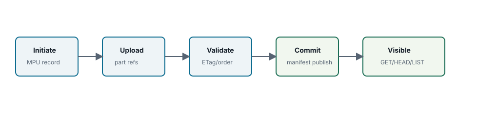

Chapter 06 <span class="badge">Community</span> <span class="badge enterprise">Enterprise edition only sections</span>

# Multipart Write Visibility

## MPU

- initiate
- upload parts
- complete
- abort

<div class="note" markdown="1">

**Edition scope.** Multipart upload is a Community edition S3 compatibility surface. Enterprise edition only storage classes such as SBS EC may add shard validation before complete, but they do not change the S3 visibility rule.

</div>



## State Machine

| State | Metadata | S3 Visibility |
| --- | --- | --- |
| initiated | MPU record exists | object key not committed |
| parts uploaded | part records and segment refs exist | parts visible only through MPU APIs |
| complete requested | gateway validates ordered parts | not visible until transaction commits |
| committed | object version and manifest published | GET/HEAD/LIST see committed state |
| aborted | MPU aborted and parts cleaned or orphaned | object key not committed by this MPU |

## Record Model

| Record | Created By | Fields That Matter | Visibility |
| --- | --- | --- | --- |
| `MultipartUpload` | `CreateMultipartUpload` | upload id, bucket id, key, content type, storage class snapshot, encryption, Object Lock headers, state | visible through MPU APIs only |
| `MultipartPart` | `UploadPart` or `UploadPartCopy` | part number, size, ETag, segment ref | visible through ListParts only |
| `ObjectVersion` | `CompleteMultipartUpload` | final ETag, total size, ordered segment refs, lock/encryption state | visible after metadata transaction commits |
| `GCCandidate` | abort, failed publish, part replacement, overwrite cleanup | segment ref, delete reason, created time | operation-only, not S3-visible |

## Part Upload Sequence

1. Gateway reads the active MPU record and fixed storage class snapshot.
2. Gateway streams the part payload into the segment store and obtains a `SegmentRef`.
3. Metadata writes or replaces the part record. Replacing a part creates an orphan candidate for the old segment ref.
4. Gateway returns the part ETag. The part is durable enough for complete, but it is not yet a committed object version.

## Complete Sequence

1. Read MPU and requested part list from metadata.
2. Validate part existence, ordering, ETags, sizes, and digest requirements.
3. Build final manifest from part segment refs.
4. Verify storage-specific integrity where required, including EC digest checks.
5. Publish object version and remove/close pending MPU state in one metadata transaction.
6. Return S3-compatible complete response.

## Complete Transaction Shape

```text
CompleteMultipartUpload(upload_id, requested_parts)
  read MultipartUpload
  read requested MultipartPart records
  validate part order and ETags
  build ObjectVersion{SegmentRefs: ordered part SegmentRefs}
  write ObjectVersion
  write ObjectHead -> new VersionID
  write list index entry
  mark MultipartUpload completed
  write idempotency result
  enqueue replaced-head refs for GC
```

The transaction is the publish point. Before it commits, a crash leaves only an active or recoverable MPU. After it commits, every gateway must treat the new object version as visible.

## Failure Handling

If a part upload stores bytes but metadata update fails, cleanup must record orphans. If complete cannot verify storage state, it must fail before publishing the object head. If abort cannot delete all part segments, retryable orphan candidates remain for GC.

| Failure | Correct Metadata Result | Storage Result |
| --- | --- | --- |
| part bytes written, part metadata write fails | no part record or old part record remains authoritative | new segment becomes orphan candidate |
| complete request has missing or out-of-order parts | MPU remains active unless client aborts | existing part segments remain referenced by MPU records |
| storage validation fails before complete | no object version/head publish | bad segment is repair/orphan candidate depending on state |
| abort succeeds in metadata but some physical deletes fail | MPU is aborted | failed deletes remain retryable GC candidates |

## EC And KMS Interaction

<span class="badge enterprise">Enterprise edition only</span> EC multipart completion validates shard availability, per-shard checksum state, and final manifest integrity before the metadata publish. <span class="badge enterprise">Enterprise edition only</span> SSE-KMS payload encryption must persist the encryption envelope on the part or final object version so range reads can unwrap/decrypt safely after gateway failover.

## Scaling Risk

AWS S3 allows very large part counts. A single metadata transaction that embeds all part data can exceed backend limits. NAMROS should use part summaries or manifest chunking if large-part support grows beyond the current practical compatibility profile.

Reference: [S3 client compatibility guide](../../s3-client-compatibility-guide.md).
