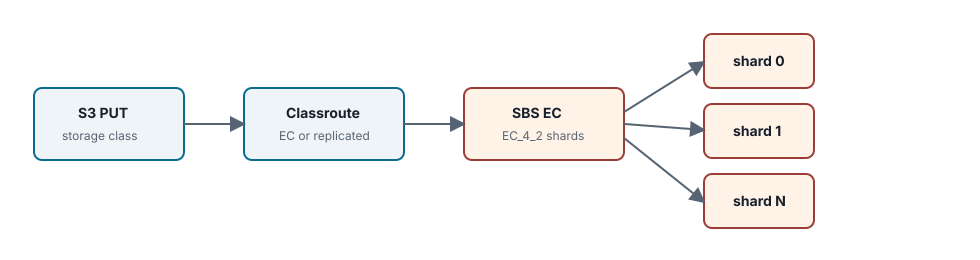

Chapter 08 <span class="badge enterprise">Enterprise edition only</span>

# SBS EC Backend Enterprise

<div class="warning" markdown="1">

**Enterprise edition only.** This chapter describes the Enterprise-only SBS EC and classroute storage contract. Community edition behavior is included only to document denial and edition-boundary expectations.

</div>



<div class="summary" markdown="1">

This chapter defines the Enterprise SBS Erasure Coding backend contract. The public Community build must deny SBS EC and classroute activation through the standard Enterprise-required boundary, while Enterprise builds may use this path to combine storage efficiency with degraded-read recovery.

</div>

## Implementation Status

| Area | Current public Community behavior | Enterprise/spec status |
| --- | --- | --- |
| SBS physical replicated path | Community SBS-backed storage can be validated with prepared SBS admin/data endpoints and a volume id. | Also available as the replicated class in Enterprise deployments. |
| SBS EC/classroute path | Edition-gated. Public Community builds must not expose an EC unlock flag or build tag. | Enterprise contract for EC shard placement, reads, repair, and audit evidence. |
| Healing commands | `dedupe-scrub` and `dedupe-repair` return Enterprise-required responses in Community builds. | Private Enterprise overlay owns EC healing and repair execution. |

## Storage Class Selection And Routing

The gateway reads storage class directives and Enterprise encryption requirements during request admission, then routes payload writes through the classroute layer.

- **Standard / replicated class:** payload segments are routed to the `sbs-physical` backend, which represents the replicated storage path.
- **EC storage class:** payload bytes are split into chunk segments and distributed across dedicated shard routes. The S3 API layer should remain unaware of physical shard placement so the object model stays decoupled from the storage layout.

| Storage Class | Backend | Typical Object Shape | Routing Rule |
| --- | --- | --- | --- |
| `STANDARD` | SBS physical replicated | small and latency-sensitive objects, default multipart parts | write replicated chunks and store physical placement in `SegmentRef` |
| `EC_4_2` | <span class="badge enterprise">Enterprise edition only</span> SBS EC | medium and large objects where 4 data + 2 parity is acceptable | split segment into stripes and write six shards per stripe |
| `EC_8_3` | <span class="badge enterprise">Enterprise edition only</span> SBS EC | larger objects and wider clusters | write eight data shards and three parity shards across compatible failure domains |
| `ARCHIVE_EC` | <span class="badge enterprise">Enterprise edition only</span> SBS EC/cold tier | lifecycle-transitioned or sealed objects | lower repair priority, stricter audit and transition records |

## Object Manifest To EC Shards

An EC object is still a NAMROS object version first. The object version contains segment refs. Each EC segment ref stores the storage class snapshot, EC profile generation, and placement snapshot required to locate its stripes and shard roles.

```text
ObjectVersion v-19
  SegmentRef seg-001
    StorageClass: EC_4_2
    Placement.Layout: sbs-ec-shards
    Placement.Chunks:
      stripe 0 data shard 0 -> node/pool A
      stripe 0 data shard 1 -> node/pool B
      stripe 0 data shard 2 -> node/pool C
      stripe 0 data shard 3 -> node/pool D
      stripe 0 parity shard 0 -> node/pool E
      stripe 0 parity shard 1 -> node/pool F
```

The S3 client never sees this layout. It sees one object with one key, one version id, one ETag/checksum contract, and normal range-read behavior. The EC layout is an internal storage contract used by reads, repair, healing, and evidence collection.

## EC_4_2 Geometry And Quorum

The default EC model is a `K+M` layout. **EC_4_2** uses four data shards and two parity shards, distributed across six storage nodes.

| Quorum type | Minimum available shards | Failure tolerance |
| --- | --- | --- |
| **Write quorum** | K + M, all six shards | Conservative write policy: complete the upload only after every shard write succeeds. |
| **Read quorum** | K, at least four shards | Read recovery is possible when up to two shards are lost or offline. |

### Degraded Read

When up to two shards are unavailable during a read, the Enterprise gateway performs inline Reed-Solomon recovery using the remaining healthy data or parity shards. The recovered plaintext stream is returned to the S3 client without exposing shard placement details.

| Read Case | Shard Access | Result |
| --- | --- | --- |
| all data shards healthy | read only the needed data shards for full/range request | lowest overhead path |
| one or two shards missing | read additional data/parity shards and reconstruct missing payload | degraded read succeeds and should record repair evidence |
| more missing/corrupt shards than parity can cover | insufficient quorum | return `ServiceUnavailable`; do not synthesize partial bytes |
| checksum mismatch within tolerance | reconstruct from healthy shards | read can succeed while scheduling shard repair |

## Integrity Hardening In CompleteMultipartUpload

The multipart completion path must fail closed when shard integrity cannot be proven.

1. **Shard checksum verification:** compute and validate per-shard checksums when each part segment is written to SBS storage.
2. **Final manifest signing:** during `CompleteMultipartUpload`, compute the SHA-256 hash chain for all combined segments and publish the object metadata only if unrecoverable shard loss has not been detected.
3. **S3 error mapping:** return a stable `ServiceUnavailable` response if the upload cannot be safely committed.

Integrity checks protect the metadata publish point. If EC shard loss is discovered before complete, the object version must not be published. If corruption is found during a later read and parity can recover it, the read may complete while a repair candidate is recorded. If parity cannot recover it, the read fails rather than returning guessed bytes.

## Healing And Inspection

When missing shards are detected, Enterprise repair workers regenerate them into newly provisioned drive areas and verify final digest integrity. Public Community builds document these command names only as edition-gated boundaries; operators should not expect EC repair execution without the private Enterprise overlay.

## Small Object Policy

EC is inefficient for very small objects because each object may require multiple shard records, checksums, and placement entries. The storage class catalog should define minimum object sizes and fallback behavior. A small streaming `PutObject` may use the replicated class, while a large multipart upload can be routed to EC at initiation time. Once a version is committed, its storage class generation remains fixed.

## Community Denial Contract

Community builds may parse EC storage class names for compatibility, but they must not expose an unlock flag, environment variable, public build tag, or partial classroute path that activates EC. Requests that require EC placement should fail with the documented Enterprise-required response before bytes are accepted.
