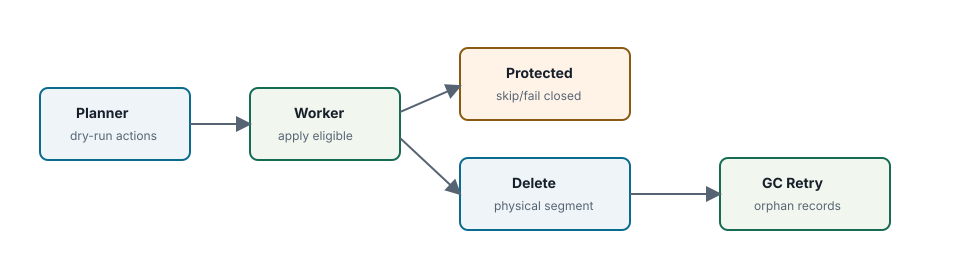
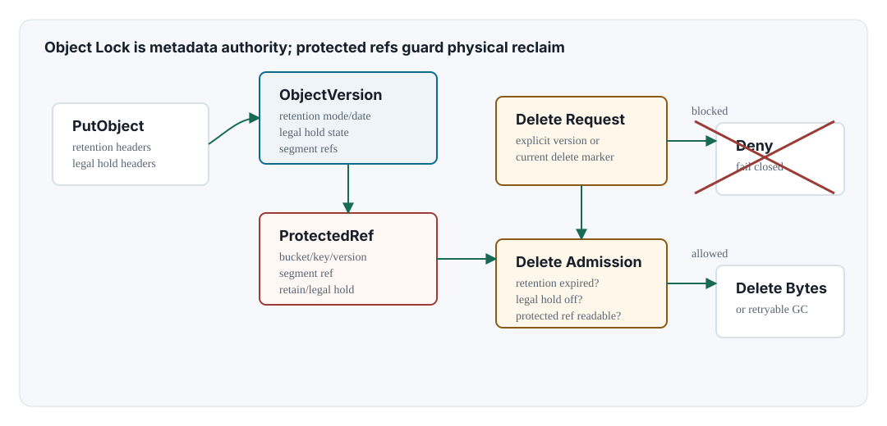

Chapter 09 <span class="badge">Community</span> <span class="badge enterprise">Enterprise edition only sections</span>

# Versioning Lifecycle Object Lock

## Protection

- versioning
- lifecycle
- Object Lock
- protected refs

<div class="note" markdown="1">

**Edition scope.** This chapter mixes Community edition versioning/lifecycle behavior with Enterprise edition only Object Lock/WORM enforcement. Community builds must reject Object Lock, WORM, and related compliance surfaces with Enterprise-required responses rather than partially enforcing them.

</div>



## Versioning Model

Versioned buckets can hold multiple committed object versions and delete markers. A normal current delete in a versioning bucket creates a delete marker rather than physically deleting all historical payloads.

| Operation | Metadata Effect | Payload Effect |
| --- | --- | --- |
| PUT current object | publish new current version | new manifest references segments |
| DELETE current object | create delete marker when versioning is enabled | old segments remain reachable |
| DELETE explicit version | remove specific version if policy allows | segments become GC candidates if unreferenced |

## Version Lineage

Object versioning is modeled as a lineage of immutable version records under one bucket/key. The current object head points to the latest visible version or delete marker. Historical versions remain addressable through explicit version id requests until lifecycle, policy, and protection rules allow removal.

```text
bucket b-001, key reports/q4.csv
  ObjectHead -> version v-0003
  versions:
    v-0001 committed payload version
    v-0002 committed payload version
    v-0003 delete marker, latest=true
```

A delete marker changes namespace visibility but does not automatically delete older payload. Physical reclaim is a later GC decision that must walk object versions, protected refs, shared object refs, and storage delete admission.

## Lifecycle Planner And Workers

Lifecycle planning reads bucket rules, object versions, active MPU records, Object Lock state, and protected refs. It can produce eligible actions, blocked actions, and abort-incomplete-MPU candidates. Workers execute only eligible actions and record failures for retry where appropriate.

| Lifecycle Action | Metadata Inputs | Worker Output | Storage Effect |
| --- | --- | --- | --- |
| expire current object | bucket lifecycle rule, object head, versioning state, Object Lock state | delete marker or explicit version removal | payload remains until unreferenced and unprotected |
| expire noncurrent version | version age, latest marker, retention/legal hold, protected refs | version delete or blocked action record | segment refs become GC candidates if no other reachability remains |
| abort incomplete MPU | MPU age, part records, lifecycle abort rule | MPU aborted, part refs listed for cleanup | part segment deletes or retryable GC candidates |
| transition storage class | source version, target class policy, lock/protection state | new placement/transition operation record | copy/rewrite bytes, then protect old refs until transition commits |

## Object Lock Metadata



<span class="badge enterprise">Enterprise edition only</span> Object Lock is represented as object-version metadata first. SBS protected-root state can enforce lower-level delete safety, but the S3 semantics live in NAMROS metadata.

| Record | Meaning | Delete Rule |
| --- | --- | --- |
| bucket Object Lock configuration | Object Lock enabled flag and default retention mode/duration | Object Lock enabled buckets keep versioning enabled |
| object version retention | governance or compliance mode and retain-until timestamp | compliance cannot be shortened; governance requires authorized bypass and audit |
| object legal hold | ON/OFF hold state independent of retention date | ON blocks delete regardless of retention date |
| protected ref | segment/shared object delete guard derived from version protection | physical delete cannot proceed while active or unreadable |

## Object Lock And WORM

<span class="badge enterprise">Enterprise edition only</span> Object Lock/WORM enforcement protects object versions from deletion until retention and legal-hold rules allow it. Community builds return Enterprise-required errors for Object Lock surfaces.

## Delete Admission Order

1. Resolve the bucket, key, versioning state, and target version.
2. Evaluate object retention mode and retain-until timestamp.
3. Evaluate legal hold state.
4. If governance bypass is requested, validate authorization and create an audit event.
5. Check NAMROS protected refs for every segment or shared object root.
6. Ask the storage backend or SBS protected-root hook to admit physical delete.
7. Only then delete payload bytes or mark the ref as a retryable GC candidate.

## Protected Ref Fail-closed Rule

Physical segment deletion must check active protected refs. If the check fails, deletion is skipped or failed closed. Governance bypass, when allowed, must be authorized and audited with a reason.

## Clock And Audit Requirements

Retention is only as trustworthy as its time source and audit trail. Enterprise deployments should record the observed clock source, request id, principal, bypass reason, previous retention state, next retention state, and operation hash chain. If time-source status is unknown for a retention-sensitive operation, the conservative behavior is to deny or defer the delete.

## Community Denial Semantics

Community should not partially enforce Object Lock. It should clearly reject Object Lock/SSE-KMS/WORM requests as Enterprise-only. This avoids false compliance signals.
