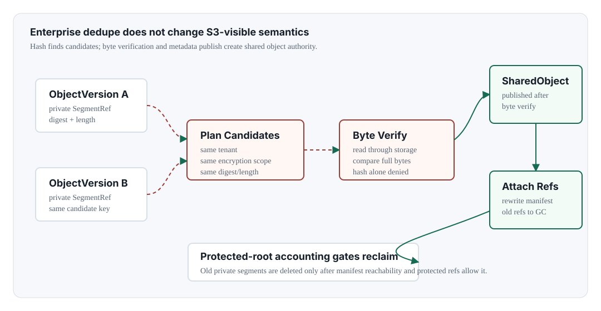

Chapter 10 <span class="badge enterprise">Enterprise edition only</span>

# Dedupe And Shared Objects <span class="badge enterprise">Enterprise edition only</span>

## Dedupe

- admission
- verification
- shared refs
- repair

<div class="warning" markdown="1">

**Enterprise edition only.** This chapter describes Enterprise-only dedupe and shared-object contracts. Community edition behavior is included only to document stub and Enterprise-required denial expectations.

</div>

## External Contract

Dedupe is not an S3-visible API. Clients should see identical bytes, metadata, and version semantics before and after dedupe. Dedupe is an internal Enterprise operation.



## Authority Rule

Hash indexes are candidate indexes only. They are not object equality proof, delete authority, or tenant boundary authority. The authoritative records are the committed object version manifest, shared object record, shared object refs, protected refs, and audit/operation records.

## Admission Modes

| Mode | Purpose | Risk Control |
| --- | --- | --- |
| plan-only | identify candidates without mutation | safe for inspection |
| post-process ack | operator-approved conversion after verification | requires byte verification |
| ingest-assisted | future optimized candidate path | must not bypass verification rules |

## Metadata Records

| Record | Purpose | Important Fields | Authority Caveat |
| --- | --- | --- | --- |
| `SharedObject` | byte-verified shared payload root | shared object id, tenant id, source version id, size, digest, storage class, segment refs, ref count, protected root count | published only after byte verification; refcount is repairable summary |
| `SharedObjectRef` | object-version attachment to shared bytes | shared object id, bucket id, key, version id, segment refs | must agree with object version manifest |
| `DedupeOperationRecord` | plan/ack/scrub/repair operation evidence | operation id, status, scanned/acked/skipped/retry counts, attempts, errors | workers resume from records; CLI output is not authority |
| `SharedObjectRelease` | old private segment cleanup after attach | release id, shared object id, segment ref, delete reason, status | physical reclaim remains protected-ref gated |

## Candidate Rules

A candidate must be immutable, committed, same tenant, same encryption domain or same key scope, same lifecycle mode, compatible storage class generation, and supported durability profile. The candidate key includes digest algorithm, content digest, length, storage class generation, lifecycle mode, durability profile, tenant scope, and encryption scope.

```text
dedupe candidate grouping key
  tenant_id
  encryption_scope
  lifecycle_mode
  durability_profile
  digest_algorithm
  content_digest
  logical_length_bytes
  storage_class_generation
```

## Publish Transaction

1. Scan object versions and identify candidates.
2. Verify candidate bytes against existing shared-object bytes.
3. Create or update shared object ref/refcount metadata.
4. Attach object version manifest to shared segment refs in a metadata transaction.
5. Return previous private refs for protected orphan handling.

## Background Dedupe Flow

1. A scanner records digest and length candidates for committed object versions.
2. An operator runs plan-only inspection and reviews tenant, lifecycle, encryption, and durability admission.
3. The ack path reads candidate bytes through the storage adapter and performs mandatory byte verification.
4. After verification, the worker creates or reuses a shared object record.
5. A metadata transaction attaches object versions to the shared object and records previous private refs as release candidates.
6. GC reclaims old private refs only after protected-root admission succeeds.

## Read Semantics

After attach, the S3 read path still resolves object head and object version first. The manifest may point to shared object refs, but the client must receive exactly the same bytes, headers, ETag/checksum semantics, version id, tags, metadata, and Object Lock state that it would have seen before dedupe.

## Forbidden Shortcuts

| Shortcut | Why It Is Forbidden |
| --- | --- |
| hash-only inline dedupe | hash collision, poisoning, tenant leakage, and crash recovery hazards |
| cross-tenant dedupe | can leak existence and size information across isolation boundaries |
| cross-key encrypted dedupe without same-key proof | ciphertext equality and plaintext equality cannot be assumed |
| refcount-only delete | manifest reachability and protected refs are the delete authority |
| hidden storage class flag | ordinary writes must not silently become dedupe-enabled writes |

## Repair And Scrub

Refcount repair recalculates shared-object reference counts from metadata. Scrub reports should include collection counts, pending shared-object releases, audit-chain summary, and recent dedupe/GC operation context.

## Inline Dedupe Roadmap

Object storage is structurally friendlier to inline dedupe than random-write block storage because `PutObject` and `CompleteMultipartUpload` publish immutable object versions. Even so, verified inline dedupe is a later product goal, not the baseline. The minimum gate is same tenant, compatible encryption domain, already durable shared payload, byte verification or a reviewed strong proof-of-content model, idempotent crash recovery, and protected-root accounting at attach time.

## Community Stub Behavior

Community source export replaces private dedupe implementation with a stub that preserves safe status/metrics compatibility while returning Enterprise-required errors for worker/scheduler execution.
