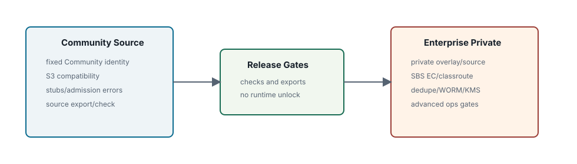

Chapter 14 Community Enterprise edition only sections

# Release And Edition Boundaries

## Boundary

- Community export
- stubs and overlays
- release gates
- deferred automation

**Edition scope.** This chapter defines the public Community source boundary and the Enterprise edition only private source/overlay boundary. Enterprise implementation replacement, packaging, and feature activation are private-distribution responsibilities, not public Community build switches.

## Community Source Boundary

Community source has a fixed Community identity, no Enterprise runtime flag, no Enterprise environment switch, and no public build tag that unlocks Enterprise behavior. Enterprise-only implementation packages are excluded from public source export or replaced with stubs.

| Allowed In Public Community | Forbidden In Public Community |
| --- | --- |
| S3 core gateway, metadata repository, local/Pebble/TiKV metadata backends, etcd registry, local/SBS replicated storage integration where packaged | runtime flag, environment variable, build tag, hidden config key, or CLI switch that enables Enterprise behavior |
| Enterprise-required denial stubs and public explanation of edition boundaries | private implementation bodies for EC healing, WORM enforcement, dedupe execution, KMS lifecycle, compliance evidence, advanced operations |
| Public architecture and operator documentation with explicit Enterprise labels | private lab host details, private release harness, competitive analysis, raw internal development notes |

## Export Process

| Target | Purpose |
| --- | --- |
| `make check-community-export` | detect public Enterprise unlock or implementation leakage |
| `make export-community` | create public Community source tree and tarball |
| `make community-release-check` | run Community test, compatibility, source check, export sequence |
| `make enterprise-release-check` | private distribution readiness entrypoint |

## Boundary Checks

Release checks should fail closed. A public source tree is accepted only when it has a Community identity, public documentation has no private links or local paths, Enterprise implementation imports do not leak, and public build targets cannot assemble an Enterprise binary.

| Check | What It Protects | Failure Meaning |
| --- | --- | --- |
| source export allow/exclude rules | public tree contents | private docs/code or generated artifacts may have leaked |
| edition source scan | runtime and build-time boundary | Community source may contain an Enterprise unlock path |
| HTML docs check | public documentation quality and link safety | broken docs, raw Markdown leakage, private path/link leakage, missing Enterprise marker |
| Community package tests | denial stubs and Community behavior | public behavior regressed or Enterprise imports leaked into Community commands |

## Private Overlay

Enterprise edition only Enterprise private source replaces Community stubs, restores implementation packages, and produces Enterprise binaries/packages from private source or private overlay assembly. Public users should not be asked to enable Enterprise by command flag or environment variable.

## Public Documentation Rule

Public documentation may describe Enterprise-only architecture when the text is useful to understand product boundaries, failure behavior, or storage semantics. It must not include private build paths, private source locations, private lab topology, unpublished release instructions, or instructions that imply Community users can enable Enterprise features by configuration.

## Command Behavior

Community admin commands and S3 requests that touch WORM, dedupe, SBS EC, KMS, or compliance operations must return the standard NAMROS Enterprise Edition requirement error. TiKV metadata and etcd active-active operations are Community features. Silent no-op behavior is not acceptable because it creates false operational or compliance expectations.

| Request Surface | Community Behavior | Enterprise Behavior |
| --- | --- | --- |
| SBS EC/classroute storage class | deny before accepting payload bytes | route to EC backend and record EC placement snapshot |
| Object Lock/WORM enforcement | deny Enterprise-only surfaces; do not claim partial enforcement | enforce retention/legal hold/protected refs and audit bypass |
| Dedupe execution | status/metrics stubs and Enterprise-required operation errors | plan, byte verify, shared object attach, scrub, repair |
| SSE-KMS/key lifecycle | deny KMS payload/key management paths | store envelopes, manage key state, fail closed on key admission |
| Compliance evidence package | deny or provide limited boundary explanation | generate scoped evidence with audit/time/key/object-lock sections |

## Deferred Release Automation

Private overlay assembler, manifest validation, public CI, artifact signing, SBOM, NOTICE, and publication automation are intentionally deferred release-operational hardening tasks. They must preserve the same edition boundary.

This chapter is the public reference for the Community source boundary and Enterprise-required behavior.
