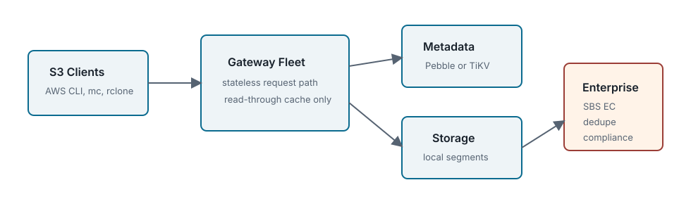

Object Storage Product Docs

# NAMROS

<div class="note" markdown="1">

**Edition scope.** This page includes Community edition behavior and Enterprise edition only sections. Treat any area marked <span class="badge enterprise">Enterprise edition only</span> as unavailable in public Community builds except for documented denial behavior.

</div>

<div class="summary" markdown="1">

NAMROS expands to Network Attached Multipath Resilient Object Storage and is pronounced [nae-muh-ross].

NAMROS is an S3-compatible object storage project. The Community edition includes normal S3 object workflows, external-client compatibility, active-active gateway operation, TiKV metadata, etcd coordination, and SBS replicated object storage. Enterprise capabilities add SBS-backed EC storage, WORM/Object Lock enforcement, dedupe, KMS posture, compliance evidence, and advanced MCP-assisted operations.

</div>



## Product Positioning

NAMROS is an object storage product: Network Attached Multipath Resilient Object Storage, pronounced [nae-muh-ross]. It accepts S3-compatible requests through `namros-gateway`, stores namespace state in a metadata backend, and stores payload bytes through a segment storage backend. The gateway process is intentionally stateless with respect to authoritative object state.

NAMROS is not NAMRBD. NAMRBD is a network attached block-device product. NAMROS may reuse SBS/NAMRBD substrate pieces for Enterprise physical storage, but users interact with NAMROS through S3 clients and object storage semantics.

## Supported Deployment Shapes

| Shape | Purpose | Primary Dependencies | Edition |
| --- | --- | --- | --- |
| Local Community | Development, S3 API verification, user-space compatibility smoke | single `namros-gateway`, Pebble or memory metadata, local segment store | <span class="badge">Community</span> |
| Compatibility Lab | AWS CLI, MinIO client, rclone, s3fs-fuse validation | local gateway plus client tools; Linux FUSE host when needed | <span class="badge">Community</span> |
| Active-active Metadata Lab | multi-gateway availability and cache correctness | TiKV/PD, etcd, shared segment path | <span class="badge">Community</span> |
| SBS EC Lab | EC multipart write/read path | TiKV/PD, SBS service/data, prepared volume and shard routes | <span class="badge enterprise">Enterprise edition only</span> |

## 5-Minute Community Quick Start

This path is intended for a GitHub developer checking the public Community tree for the first time.

```sh
git clone https://github.com/nosway/namros.git
cd namros
make test-community
make build-community
make run-dev
```

Keep the gateway running, then use a second terminal for a basic S3 round trip:

```sh
export NAMROS_ENDPOINT=http://127.0.0.1:9000
export AWS_ACCESS_KEY_ID=namros
export AWS_SECRET_ACCESS_KEY=namros-secret
export AWS_DEFAULT_REGION=us-east-1

aws --endpoint-url "$NAMROS_ENDPOINT" s3api create-bucket --bucket quickstart
printf 'hello namros\n' > /tmp/namros-hello.txt
aws --endpoint-url "$NAMROS_ENDPOINT" s3api put-object --bucket quickstart --key hello.txt --body /tmp/namros-hello.txt
aws --endpoint-url "$NAMROS_ENDPOINT" s3api get-object --bucket quickstart --key hello.txt /tmp/namros-readback.txt
aws --endpoint-url "$NAMROS_ENDPOINT" s3api list-objects-v2 --bucket quickstart
```

Expected result: the final list includes `hello.txt`, and `/tmp/namros-readback.txt` matches the original payload.

## Community And Enterprise Summary

| Capability | Community | Enterprise |
| --- | --- | --- |
| S3 bucket/object API | Included | Included |
| AWS CLI/mc/rclone smoke | Included | Included |
| s3fs-fuse default profile | Compatibility target | Compatibility target |
| TiKV metadata and etcd gateway registry | Included | Included |
| SBS replicated object storage | Included; source export needs NAMRBD Community module packaging | Included |
| SBS EC/classroute | Enterprise-required error | Available |
| WORM/Object Lock enforcement, dedupe, KMS, compliance evidence | Enterprise-required error | Available |
| Web console and monitoring | Read-only dashboard and report viewer | Approved operations and Enterprise feature panels |
| S3 object browser integration | Object Explorer Lite plus external S3 browser recipes | Approved object operations after policy controls |
| Private overlay and advanced release gates | Not present | Private distribution |

## Persona-Based Navigation

We recommend starting paths tailored to your specific organizational persona and technical goals:

<div class="cards" markdown="1">

<div class="card" markdown="1">

### Application Developer

Application Developer Path

Learn S3-compatible endpoints, credential authorization, multipart upload APIs, and integration runbooks using SDKs (Go, Python, Java) and AWS CLI.

[Open User Manual →](user-manual.md)

</div>

<div class="card" markdown="1">

### System Administrator

Cluster Operator Path

Configure preflight OS kernel parameter tuning, manage etcd/TiKV clusters, execute node maintenance flows, and run self-healing/rebalance procedures.

[Open Admin Guide →](admin-guide.md)

</div>

<div class="card" markdown="1">

### Architecture Reviewer

System Architect & Security Path

Analyze stateless active-active architecture, Erasure Coding (EC_4_2) layouts, OIDC IAM evaluation rules, and HashiCorp Vault SSE-KMS fail-closed models.

[Open Architecture Manual →](architecture-manual/index.md)

</div>

<div class="card" markdown="1">

### Operations Planner

Product & Enterprise Path

Review Enterprise contracts for Cross-Region replication, event notifications, tenant quotas/QoS, and approved operations without assuming those surfaces are enabled in Community builds.

[Open Operations Guides →](web-console-monitoring-guide.md)

</div>

</div>

## Current Validation Status

The HTML documentation set is validated by `make html-docs-check`. Product behavior is validated by unit tests, source-boundary checks, and container smoke targets depending on the deployment shape.

| Target | Purpose | Reference |
| --- | --- | --- |
| `make docs-render-check` | documentation build, rendered page bodies, resolved diagram paths | `tools/check-docs-render.py` |
| `make check-community-export` | Community identity, Enterprise boundary, focused gate tests | [release boundary](architecture-manual/chapters/14-release-and-edition-boundaries.md) |
| `make container-local-smoke` | containerized local gateway smoke | [container deployment guide](container-deployment-guide.md) |
