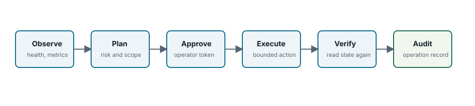

AI 보조 운영 <span class="badge">Community</span> <span class="badge enterprise">Enterprise edition only sections</span>

# NAMROS MCP 운영 가이드

<div class="note" markdown="1">

**Edition scope.** 이 페이지는 Community edition observe/probe resource와 Enterprise edition only MCP tool을 함께 다룹니다. Enterprise-only tool은 공개 Community 빌드에서 표준 Enterprise-required 응답을 반환합니다.

</div>



## 모델

MCP 서버는 observe mode와 operate mode를 구분합니다. Observe mode는 상태, 메트릭, 리포트, 런북을 읽습니다. Operate mode는 명시적으로 승인된 제한 범위의 작업만 실행하고 결과를 검증/감사합니다.

MCP는 자동 복구 엔진이 아닙니다. AI assistant는 상태를 해석하고 운영자가 승인할 작업 계획을 제안할 수 있지만, 상태 변경은 승인 정책과 감사 envelope를 거쳐야 합니다.

## 설치 및 실행 형태

```sh
namros-mcp \
  -mode observe \
  -gateway-endpoint http://127.0.0.1:9000 \
  -release-report-dir release-reports \
  -compat-report-dir compat-reports
```

초기 전송 방식은 로컬 운영자와 데스크톱 assistant 사용을 위한 stdio입니다. 향후 HTTP/SSE 전송도 동일한 승인 및 마스킹 규칙을 유지해야 합니다.

## 리소스 카탈로그

| 리소스 | 목적 | 에디션 |
| --- | --- | --- |
| `namros://product/edition` | 빌드 식별자와 기능 플래그 | Community |
| `namros://gateway/health` | 게이트웨이 준비 상태와 엔드포인트 상태 | Community |
| `namros://metadata/status` | 메타데이터 백엔드 식별자와 컬렉션 수 | Community |
| `namros://operations/metrics` | 사용 가능한 GC/중복 제거/스케줄러 메트릭 | Community |
| `namros://runbooks/index` | 운영자 런북 카탈로그 | Community |
| `namros://enterprise/ec/status` | EC/SBS 상태 요약 | Enterprise |

## 도구 클래스

| 클래스 | 기본값 | 예시 |
| --- | --- | --- |
| observe | 허용 | 상태, 관리자 상태, 릴리스 리포트 |
| probe | 승인 필요 | 호환성 스모크, 게이트웨이 대기 |
| repair | 승인 필요 | GC 재시도, 중복 제거 스크럽 |
| protect | 승인 필요 | 메타데이터 백업, 컴플라이언스 증빙 패키지 |
| destructive | 비활성 | purge, governance bypass, crypto erase |

## MinIO 스타일 진단 매핑

| 진단 영역 | MCP 리소스/도구 후보 | 가이드 |
| --- | --- | --- |
| 복제 | `namros.replication.status`, 지연 요약 | [복제 가이드](replication-disaster-recovery-guide.md) |
| 인벤토리/배치 | `namros.inventory.status`, 배치 작업 리포트 색인 | [인벤토리 가이드](inventory-batch-operations-guide.md) |
| Quota/QoS | `namros.quota.status`, 임계치 알림 | [쿼터 가이드](quota-qos-guide.md) |
| KMS | `namros.kms.status`, 키 상태 요약 | [KMS 가이드](kms-encryption-guide.md) |
| Chaos/soak | `namros.chaos_soak.latest` | [Soak 가이드](performance-chaos-soak-guide.md) |
| 지원 번들 | `namros.incident.bundle`, 마스킹된 리포트 수집 | [관리자 가이드](admin-guide.md) |

## 작업 규약

운영자가 승인한 모든 도구는 `plan`, `preflight`, `apply`, `verify`, `audit` envelope를 남겨야 합니다.

```json
{
  "schema_version": "namros.mcp.operation.v1",
  "operation_id": "op-...",
  "tool": "namros.compat.user_space.run",
  "risk_class": "probe",
  "mode": "operate",
  "approval": {
    "required": true,
    "policy": "external-token",
    "reference": "ticket-1234"
  },
  "plan": {},
  "preflight": {},
  "result": {},
  "verification": {},
  "audit": {
    "local_path": ".namros/mcp-operations/op-....json"
  }
}
```

## 비밀값 마스킹 및 장애 번들

접근 키, 비밀 키, KMS material, 사전 서명 URL, Authorization 헤더, 오브젝트 페이로드 바이트는 기본적으로 출력하면 안 됩니다. 장애 번들은 마스킹된 명령줄, 엔드포인트 식별자, 상태 JSON, 메트릭 JSON, 런북 제안, 작업 레코드를 포함해야 합니다.

## 예시 세션

| 상황 | 관찰 | 승인된 작업 | 검증 |
| --- | --- | --- | --- |
| 게이트웨이 준비 타임아웃 | 상태, 로그, 관리자 상태 | `namros.gateway.health.wait` | 상태가 2xx가 되거나 번들이 타임아웃 증빙을 캡처 |
| 메타데이터 백엔드 장애 | 관리자 상태, 백엔드 식별자 | 백엔드 접근이 가능하면 메타데이터 백업 생성 | 컬렉션 수 안정 |
| 호환성 실패 | 최신 호환성 리포트 | `namros.compat.user_space.run` | 클라이언트별 통과/실패 요약 |
| Enterprise 기능 거부 | 에디션 리소스 | 기본값 없음 | assistant가 예상된 Community 동작을 설명 |

Community 빌드에서 Enterprise 전용 MCP 도구는 표준 NAMROS Enterprise Edition 필요 오류를 반환합니다.
